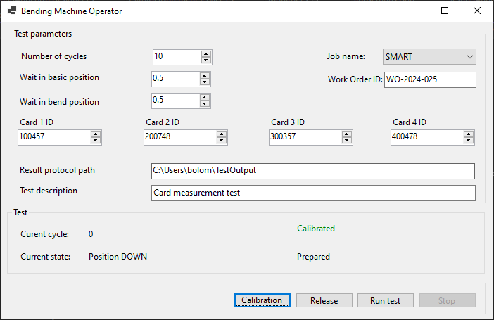
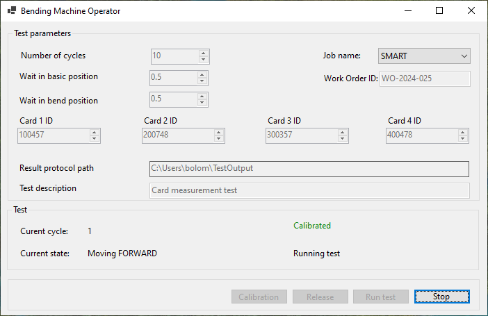
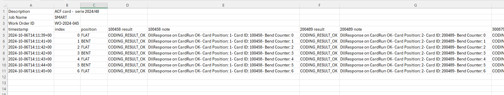

# ACF Bending machine - application user manual
This manual describe application for controlling of ACF bending machine. The machine serves for testings of smart cards. The machine consists of these important parts:
- Bending machine box
- Door (connected to safety switch), any operation is stopped while the door is open
- 4 slots for tested cards


## Main window
After application is launched, the main window "Bending Machine Operator" is opened. 



The window contains these components:
- Test parameters:
    - **Number of cycles**, number of test cycles (bend, unbend) 
    - **Wait in flat position**, delay between the piston reaches flat position and measurement is started [seconds]
    - **Wait in bent position**, delay between the piston reaches bent position and measurement is started [seconds]
    - **Job name**, parameter of test, chosen from drop-down list
    - **Work order ID**, parameter of test (can be empty)
    - **Card IDs**, identification number of smart card; must be set for each card (each card slot); card ID is parameter of test
    - **Result protocol path**, path to directory where the measurement protocols (in CSV) are stored. Can be changed after double-click to this tet box.
    - **Test description**, additional note for measurement. This value is stored in a measurement protocol.
- Information:
    - **Current cycle**, index of running test cycle
    - **Current state**, current position of piston
    - **Calibration label**
    - **Application message**, gives an information what is happening, warning about error states

## Measurement process
Measurement should be performed in these steps:
- Application is started.
- "Bending Machine Operator" windows opens.
- Application tries to connect the hardware.
  - If connection attempt fails, warning is displayed. The application needs to be restarted.
- Piston is set to unbent position automatically.
- Some test parameters are prefilled with default values.
- Parameters of test are set manually by the operator.
- Calibration is started:
    - It is verified the piston is in a flat position.
    - Test parameters (Job name, Work order ID) are sent to Card reader. The reader is initialized.
    - After calibration process a green label "Calibrated" is displayed.
- Measurement:
    - The test is started by clicking the button "Run test".
    - Card reader performs measurement in a flat position.
    - Test cycles run:
        - Card is bent.
        - Wait for measuremnt in a bent position.
        - Measurement in a bet position is performed.
        - Card is unbent.
        - Wait for measurement in a flat position.
        - Measuremnt in a flat position is performed.
    - After the whole measurement process is finished, the results are written in a test protocol.

### Calibration
Calibration needs to be done before the measuremnt. Parameters "Job name" and "Work order ID" are passed to the calibration procedure. 

If these parameters are updated, a new calibration is required. A message "Calibration expired" is shown in a window. The calibration also expires after a preset calibration timeout.

### Stop test
The test can be interrupted by the operator. It happent after click of "Stop" button. The pistons stopes moving in this state. The machine can be recovered from stop state by clicking the button "Release".

Stop button is active only during  test execution.



### Operation timeout
The measurement process is also stopped if the machine is idle for a defined timeout. It can happen e.g. in case the mechine looses pressure during measurement. In this case the measerement is stopped.

### Open door
The running measurement is also interrupted if the door is opened. It is double checked. Firstly a safety relay stops the piston and the application stops the operation as well. The application enters the stopped state after the door is closed.

### Release
The machine which is stucked can be returned into the flat position. It happens after "Release" button is clicked.

## Application settings
The application can be configured. The configuration is stored in "appsettings.json" file which is located in an application folder. There is an example of the file content:
```
{
    "PortName": "COM4",
    "OutputDirectory": "C:\\AFCBendingMachine\\TestOutput",
    "LogDirectory": "C:\\AFCBendingMachine\\TestOutput",
    "NumberOfCycles": 3,
    "DelayBasic": 0.5,
    "DelayBent": 0.5,
    "CardTypes": [ "SMART", "Classic", "Smart card" ],
    "CalibrationValidityInHours": 1,
    "MeasurementTimeoutInSeconds": 3600,
    "CsvDelimiter": ",",
    "CardReaderDll": "lib/acfmistub.dll",
    "DefaultCardIds": [1, 2, 3, 4]
}
```

Description of parameters:
- PortName: name of the port where the controller is connected
- OutputDirectory: directory where the test protocols are stored
- LogDirectory: directory where the application log is saved
- NumberOfCycles: default number of test cycles
- DelayBasic: default delay between the card is bent and the measurement
- DelayBent; default delay between the card is unbent and the measurement
- CardTypes: list of possible Job names
- CalibrationValidityInHours: timeout of calibration process
- MeasurementTimeoutInSeconds: operation timeout
- CsvDelimiter: delimiter used for csv output
- CardReaderDll: path to the DLL operating the card reader, can be absolute or relative to application folder
- DefaultCardIds: default card ids for individual card slots

## Measurement protocol
Output of each test is stored into a CSV file. The file is stored in a directory according to the path set in application.



Test parameters and test description are stored at the top of the file. The test results are structured into the rows with the following columns:
- **timestamp**: timestamp of measurement
- **index**: index of measurement
- **position**: card state (BENT/FLAT)
- **<card1 ID> result**: test result of card 1
- **<Card1 ID> note**: note to the measurement of car 1
- ... results and notes for the remaining cards